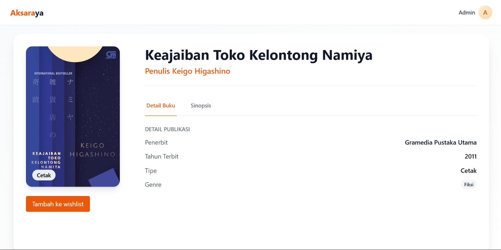
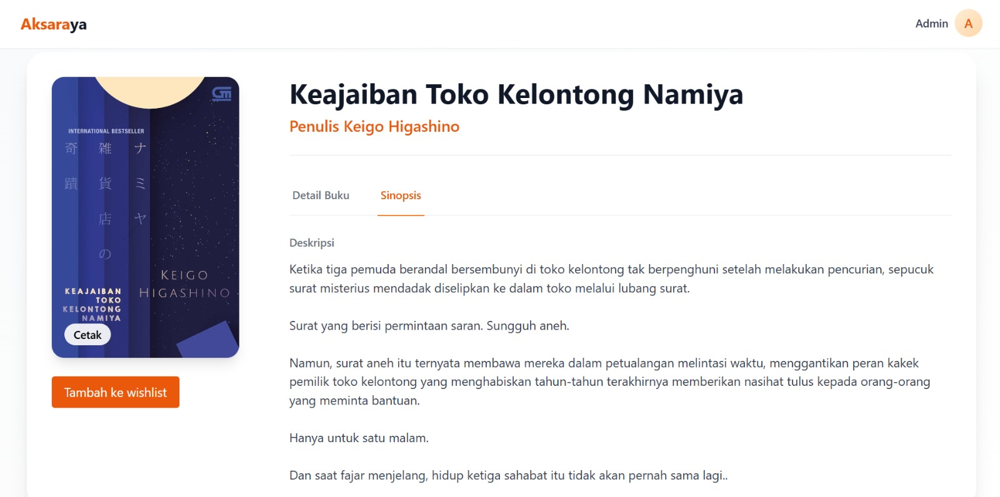

# 📚 Aksaraya

**Aksaraya** adalah aplikasi web katalog buku yang memungkinkan pengguna untuk:

- Menelusuri koleksi buku yang tersedia.
- Menambahkan buku kedalam wishlist.
- Melihat detail buku seperti:
  - **Judul Buku**
  - **Sinopsis**
  - **Genre**
  - **Penulis**
  - **Penerbit**
  - **Tahun Terbit**

Admin memiliki fitur untuk menambahkan, mengedit, dan menghapus katalog buku.






---

## 🚀 Fitur Utama

- 📖 **Lihat Katalog Buku**: Telusuri daftar buku lengkap dengan informasi penting.
- 🔍 **Pencarian & Filter**: Cari buku berdasarkan judul, genre, tipe buku, dan tahun terbit.
- 🖼️ **Tampilan Sampul**: Setiap buku memiliki gambar sampul.
- ✅ **Manajemen Admin**: Admin dapat mengelola katalog buku (CRUD).
- 🔐 **Authentication**: Sistem login untuk admin.

---

## 🛠️ Teknologi yang Digunakan

- **Frontend**: React, TypeScript, Tailwind CSS
- **Backend**: Node.js, Express.js
- **Database**: PostgreSQL (Prisma ORM)
- **Validasi**: Zod
- **Autentikasi**: JWT
- **hashing password**: bcryptjs
- **File Upload**: Multer

---

## ⚙️ Cara Menjalankan

### Backend

1. Clone repository backend:

   ```bash
   git clone https://github.com/Aldeanv/Backend_nodejs.git
   cd Backend_nodejs
   ```

2. Install dependencies:
   ```bash
   npm install
   ```
3. Buat file .env dan isi konfigurasi database.
   ```bash
   DATABASE_URL=postgresql://<username>:<password>@localhost:5433/<database_name>
   JWT_SECRET=your_secret_key
   ```
4. Jalankan migrasi Prisma:
   ```bash
   npx prisma migrate dev
   ```
5. Jalankan seeder untuk membuat akun admin:
   ```bash
   npm run seed
   ```
   Akun admin :
   - email : admin@test.com
   - password : admin123
6. Jalankan server:
   ```bash
   node src/index.js
   ```

### Frontend

1. Clone repository frontend:
   ```bash
   git clone https://github.com/Aldeanv/aksaraya.git
   cd Backend_nodejs
   ```
2. Install dependencies:
   ```bash
   npm install
   ```
3. Jalankan aplikasi:
   ```bash
   npm run dev
   ```
